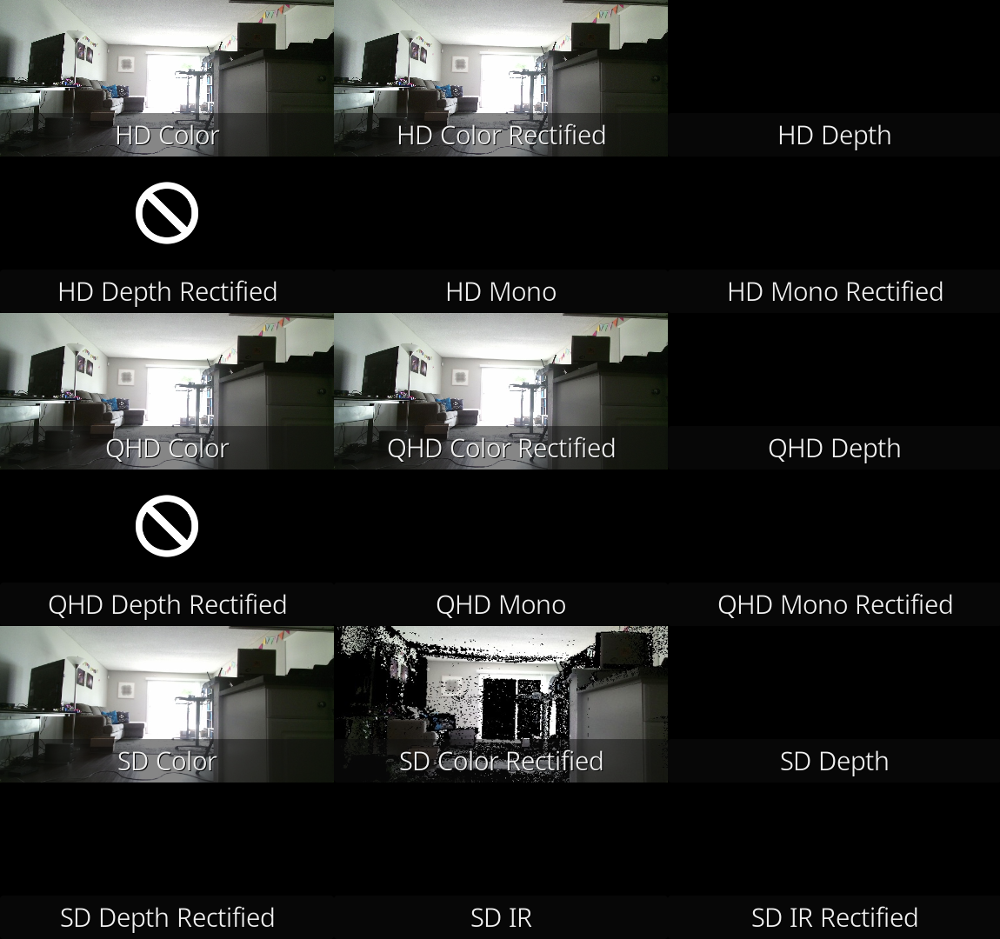

# OASIS Kinect2 for ROS 2

This repo is a ROS 2 fork of the [Institute for Artificial Intelligence - University of Bremen Kinect2 driver](https://github.com/code-iai/iai_kinect2).

It is used by the [OASIS](https://github.com/eigendude/OASIS) smarthome OS.

See below for the status of this port.

## Dependencies

All OASIS dependencies, including this one, are managed by the [oasis_tooling](https://github.com/eigendude/OASIS/tree/main/oasis_tooling) package.

The specific versions are defined in the file [depends.repos](https://github.com/eigendude/OASIS/blob/main/oasis_tooling/config/depends.repos). The dependencies for Kinect 2 functionality are:

```
repositories:
  # Requires: libturbojpeg0-dev libusb-1.0-0-dev ocl-icd-opencl-dev
  depends/libfreenect2:
    type: git
    url: https://github.com/OpenKinect/libfreenect2.git
    version: master
  # Requires: default-jdk libudev-dev libusb-1.0-0-dev
  depends/OpenNI2:
    type: git
    url: https://github.com/structureio/OpenNI2.git
    version: master
  ros-perception/image_pipeline:
    type: git
    url: https://github.com/ros-perception/image_pipeline.git
    version: rolling
  ros-perception/image_transport_plugins:
    type: git
    url: https://github.com/ros-perception/image_transport_plugins.git
    version: rolling
```

## Installation, GPU acceleration and Citations

The original README can be found at: https://github.com/code-iai/iai_kinect2

## What is working?

Currently, four topics are working:

```
/hd/image_color:

header:
  frame_id: kinect2_rgb_optical_frame
height: 1080
width: 1920
encoding: bgr8
is_bigendian: 0

/qhd/image_color:

header:
  frame_id: kinect2_rgb_optical_frame
height: 540
width: 960
encoding: bgr8
is_bigendian: 0

/sd/image_color:

header:
  frame_id: kinect2_rgb_optical_frame
height: 360
width: 640
encoding: bgr8
is_bigendian: 0

/sd/image_color_rect:

header:
  frame_id: kinect2_ir_optical_frame
height: 424
width: 512
encoding: bgr8
is_bigendian: 0
```

Here is a combined visualization of all topics. Most aren't working. HD and QHD color rectified are a duplication of the color image. Subscribing to HD and QHD depth rectified crashes the driver.



## Launch file

Due to scalability issues in the existing code, and being written before modern APIs, downscaling to SD happens in a new node. It downscales from QHD (quarter HD) to SD (in this case 640x360).

If you want the SD color topic, you can either launch the downscaler as a node, or combine it with the bridge as components in a single process to take advantage of zero-copy.

```python
def generate_launch_description() -> LaunchDescription:
    ld = LaunchDescription()

    # Example using separate nodes
    kinect2_bridge_node = Node(
        namespace=ROS_NAMESPACE,
        package="kinect2_bridge",
        executable="kinect2_bridge",
        name=f"kinect2_bridge",
        output="screen",
    )
    ld.add_action(kinect2_bridge_node)

    kinect2_downscaler_node = Node(
        namespace=ROS_NAMESPACE,
        package="kinect2_bridge",
        executable="kinect2_downscaler",
        name=f"kinect2_downscaler",
        output="screen",
    )
    ld.add_action(kinect2_downscaler_node)

    # Example using a container
    kinect_container = ComposableNodeContainer(
        namespace=ROS_NAMESPACE,
        name=f"kinect2_container_{HOSTNAME}",
        package="rclcpp_components",
        executable="component_container",
        output="screen",
        composable_node_descriptions=[
            ComposableNode(
                package="kinect2_bridge",
                plugin="kinect2_bridge::Kinect2BridgeComponent",
                name=f"kinect2_bridge_{HOSTNAME}",
            ),
            ComposableNode(
                package="kinect2_bridge",
                plugin="kinect2_bridge::Kinect2DownscalerComponent",
                name=f"kinect2_downscaler_{HOSTNAME}",
            ),
        ],
    )
    ld.add_action(kinect_container)
```

NOTE: Due to the use of old APIs, the kinect2_bridge node doesn't work as a component. Modernization is in progress.
